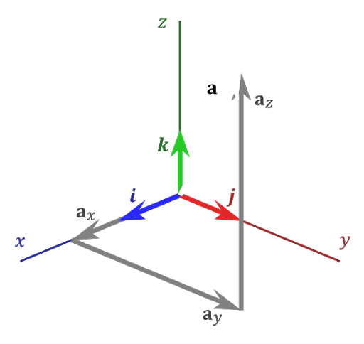

# vectors



## Initialization

### Constructor
You can initialize a `Vector` object by invoking its constructor and passing the three coordinates `x`, `y` and `z` in order. Example:

```python
>>> from vectors import Vector
>>> Vector(1, 2, 3)
Vector(1, 2, 3)
```

### From the unit vector notation
You can also initialize a ```Vector``` object with the unit vector notation by invoking the ```Vector.from_symbols``` static method. Example:

```python
>>> from vectors import Vector, i, j, k
>>> Vector.from_symbols(i+2*j+3*k)
Vector(1, 2, 3)
```

### Using spherical coordinates
In the end, you can even use spherical coordinates in order to create a ```Vector``` object by invoking the ```Vector.from_polar``` and passing the module, the azimuthal angle and the polar angle in order. Example:

```python
>>> from sympy import pi
>>> from vectors import Vector
>>> Vector.from_polar(1, pi/2, pi/2) 
Vector(0, 1, 0)
```

## Notations
   - `a*b` - equivalent to `a.dot(b)`, the dot product between `a` and `b`.
   - `a**b` - equivalent to `a.cross(b)`, the cross product between `a` and `b`.
   - `a|b` - the angle between `a` and `b` (computer using the dot product).
   - `a^b` - the angle between `a` and `b` (computed using the cross product).
   - `a.azimuthal` - the azimuthal angle (see Spherical Coordinates [Wikipedia](https://en.wikipedia.org/wiki/Spherical_coordinate_system) [Wolfram MathWorld](https://mathworld.wolfram.com/SphericalCoordinates.html)).
   - `abs(a)` - equivalent to `a.module`, the module of the vector.
   - `a.polar` - the polar angle (see Spherical Coordinates [Wikipedia](https://en.wikipedia.org/wiki/Spherical_coordinate_system) [Wolfram MathWorld](https://mathworld.wolfram.com/SphericalCoordinates.html)).

## Proofs
- [proofs/linear.py](proofs/linear.py) - proof of `a**b` being always orthogonal to a linear combination of `a` and `b`.